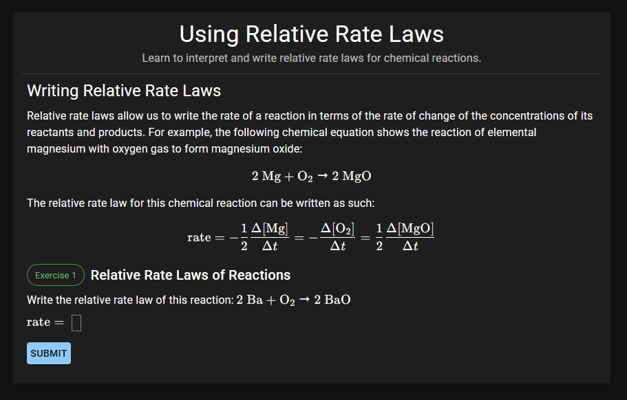

# Modulo LMS

A full-stack learning management system with interactive learning modules. Built with React, Tailwind, Typescript, Node.js, Express, and MongoDB.



## Setup

Create a .env file under the `server` folder and add the following variables:
```env
PORT=<port number>
MONGO_DB_URI=<URI to your MongoDB database>
JWT_SECRET=<JWT secret key, ideally a long string of random characters>
ADMIN_EMAIL=<email for admin account>
ADMIN_PWD=<password for admin account>
```

Then run `npm run dev` in the `client` folder and `npm start` in the `server` folder to run the application.